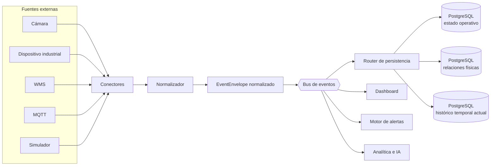
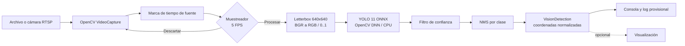
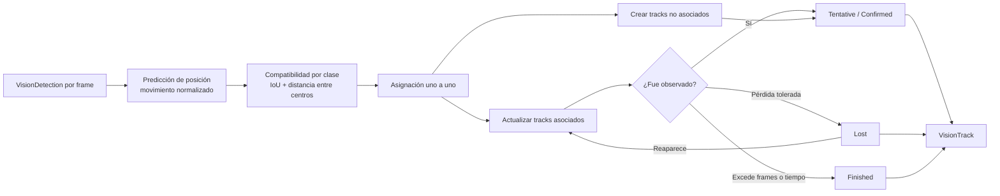
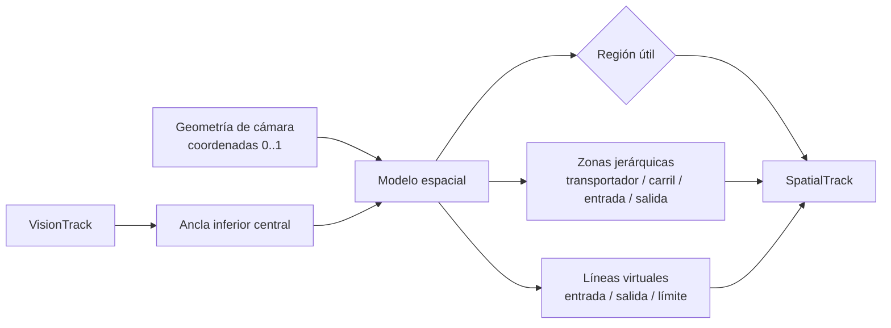
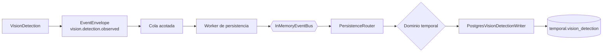
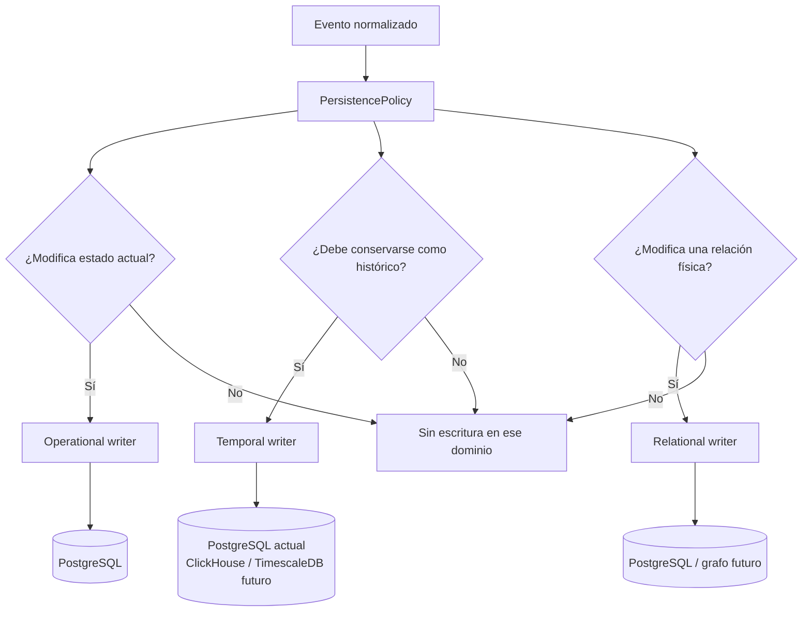
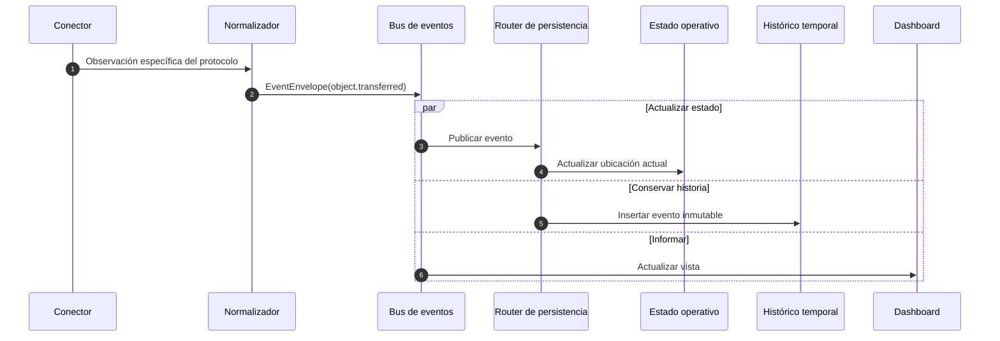
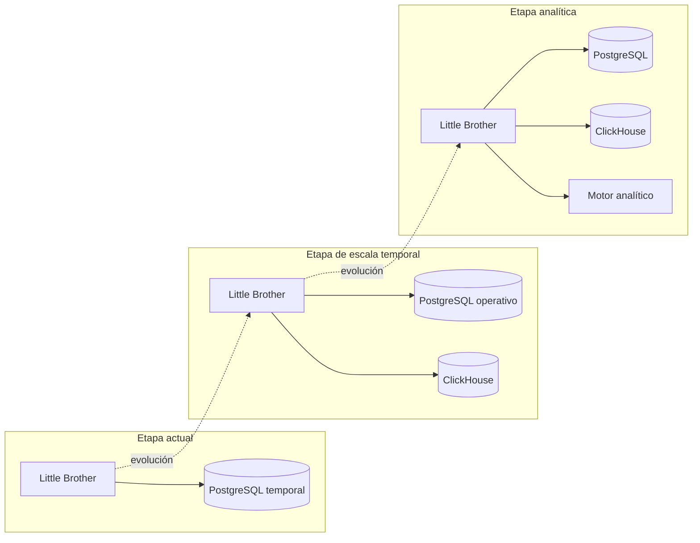
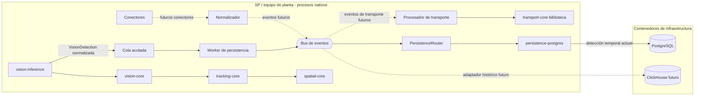

# Arquitectura de Little Brother

## Regla central

Little Brother modela el mundo físico. Las tecnologías externas son fuentes de
observaciones, no entidades centrales del dominio.

```text
Conector -> Normalizador -> Bus de eventos
                              |-> Estado operativo
                              |-> Histórico temporal
                              |-> Relaciones físicas
                              |-> Dashboard
                              |-> Alertas
                              `-> Analítica futura
```



Los conectores no conocen bases de datos. Un conector transforma su protocolo
particular en un `EventEnvelope` normalizado y lo publica mediante `EventBus`.

## Límites de los crates

### `event-core`

Define el sobre normalizado, la fuente tecnológica neutral y los puertos del
bus. No implementa una tecnología de mensajería durable.

### `transport-core`

Representa plantas, transportadores, conexiones, objetos y movimientos. No
depende de `event-core`, PostgreSQL, ClickHouse ni protocolos externos.

### `persistence-core`

Consume eventos y los clasifica en dominios operativo, temporal o relacional.
Solo define puertos; no contiene SQL ni depende de un motor concreto.

### `persistence-postgres`

Es el adaptador de infraestructura que implementa `PersistenceWriter` para las
detecciones visuales temporales. Conoce PostgreSQL, la migración y la consulta
preparada; ningún núcleo funcional depende de este crate.

### `vision-core`

Define `VisionDetection`, coordenadas normalizadas, el muestreador temporal y
NMS por clase. No conoce OpenCV, ONNX, cámaras, persistencia, seguimiento ni
reglas industriales. `apps/vision-inference` es el adaptador tecnológico que
usa OpenCV DNN y produce estas entidades.

### `tracking-core`

Consume lotes de `VisionDetection` y mantiene la identidad visual mediante
`VisionTrack`. Solo depende de `vision-core`; no conoce OpenCV, YOLO, el dominio
de transportadores, persistencia ni sistemas industriales.

### `spatial-core`

Convierte `VisionTrack` en `SpatialTrack` usando una geometría configurada por
cámara. Depende de los contratos visuales, pero no de OpenCV, YOLO, bases de
datos, PLC/WMS ni reglas operativas.

## Fase 2: motor de inferencia YOLO



La frecuencia de inferencia se decide con la marca de tiempo del flujo, no con
la velocidad a la que el proceso logra leer frames. Una fuente de 30 FPS a 5
FPS de procesamiento selecciona aproximadamente un frame de cada seis. Para
archivos se usa el tiempo del medio; para RTSP se usa un reloj monotónico local.

Formato conceptual de salida:

```text
VisionDetection
├── detection_id       fuente:frame:secuencia
├── source_id           cámara lógica
├── frame_id
├── timestamp_ms
├── class_id / class_name
├── confidence         0..1
└── bounding_box       x, y, width, height normalizados 0..1
```

Esta fase termina en la producción local de detecciones. No incluye tracking,
velocidad, desalineación, reglas industriales, eventos del bus ni persistencia.
Esos consumidores se conectarán después sin introducir sus conceptos dentro de
`vision-core`.

## Fase 3: seguimiento e identidad



```text
VisionTrack
├── track_id
├── camera_id
├── class_id / class_name
├── history[]
│   └── detection_id, frame_id, timestamp_ms, bounding_box, confidence
├── started_at_ms / last_observed_at_ms
├── state              tentative | confirmed | lost | finished
├── accumulated_confidence
└── missed_frames
```

La asociación es uno a uno y determinista. Solo compara detecciones de la misma
clase y usa una predicción de movimiento en coordenadas normalizadas para
recuperar la identidad después de pérdidas breves. Esa predicción es únicamente
una herramienta visual: no representa velocidad física.

Configuración predeterminada a 5 FPS:

```text
Confirmación:            2 observaciones
Pérdida tolerada:        5 frames
Tiempo perdido máximo:   1500 ms
IoU mínimo:              0.05
Distancia máxima centro: 0.25 de la imagen
```

Los identificadores son únicos durante una ejecución y una cámara, con formato
`camera_id:track:secuencia`. La persistencia o continuidad de IDs entre reinicios
queda fuera de esta fase.

El módulo no identifica transportadores, no calcula velocidades en metros, no
detecta desalineaciones, no genera alarmas, no consulta PLC/WMS y no persiste en
base de datos.

## Fase 4: modelo espacial



```text
SpatialTrack
├── track_id / camera_id / timestamp_ms
├── anchor              x,y normalizados
├── inside_observation_region
├── occupied_zones[]
│   └── id, nombre, tipo, parent_id, dirección
└── crossed_lines[]
    └── id, nombre, rol, sentido de cruce
```

La región útil, las zonas y las líneas se cargan desde un archivo externo. Las
zonas pueden anidarse mediante `parent_id`, lo cual permite producir relaciones
como `Transportador DEMO → Carril central → norte` sin introducir esos elementos
en el tracker. Las áreas y líneas de entrada/salida son descripciones espaciales,
no reglas de negocio ni eventos operativos.

La configuración incluida en `core/vision/config/camera-1.spatial` es solo una
demostración. Una correspondencia física válida exige una cámara fija y una
calibración específica de su escena.

Esta fase no calcula velocidad, no detecta fallas, no genera alarmas y no
persiste resultados.

## Fase 5: bus y persistencia temporal PostgreSQL



La aplicación compone las implementaciones, pero el motor YOLO únicamente
produce `VisionDetection`. La política selecciona el dominio temporal y el
adaptador PostgreSQL realiza una inserción preparada con columnas tipadas. No
se usa un documento JSON para este flujo.

```text
temporal.vision_detection
├── event_id / event_type / schema_version
├── occurred_at / observed_at / persisted_at
├── source_id / correlation_id
├── detection_id / frame_id / source_timestamp_ms
├── class_id / class_name / confidence
└── bbox_x / bbox_y / bbox_width / bbox_height
```

`occurred_at` representa el tiempo real de publicación. Para un archivo, la
posición relativa dentro del video se conserva por separado en
`source_timestamp_ms`. Los identificadores de evento incorporan una sesión y
una secuencia para evitar colisiones al reiniciar la cámara o reprocesar un
archivo.

La entrega desde video es asíncrona mediante una cola acotada. Dentro del worker
el bus y el router son síncronos, y PostgreSQL confirma transacciones por lote,
intervalo o cierre. El escritor reconecta y reintenta una vez. Un bus durable
podrá reemplazar esta cola sin modificar `vision-core`.

Esta fase persiste detecciones. Los tracks, resultados espaciales, video,
alarmas y reglas industriales permanecen fuera de su alcance.

## Evolución de persistencia

```text
Actual: PostgreSQL temporal para VisionDetection
Siguiente: PostgreSQL operativo y relacional + eventos de track/espacio
Escala: ClickHouse/Timescale para histórico + consumidores analíticos
```

El cambio de fase solo reemplaza o agrega implementaciones de
`PersistenceWriter`. Los conectores, eventos y entidades no cambian.

## Flujo de decisión de persistencia

El evento no selecciona una base de datos. Una política externa determina uno
o varios dominios y el router localiza los escritores registrados para ellos.



Un solo evento puede seguir varias ramas. Por ejemplo, la transferencia de una
caja actualiza su ubicación operativa y también se conserva en el histórico.

## Secuencia de una transferencia



## Evolución de despliegue



## Despliegue físico

Los núcleos Rust **no se ejecutan en contenedores**. Se compilan y ejecutan de
forma nativa en el SP o equipo de planta para evitar sobrecarga y conservar
acceso directo al hardware, red industrial y recursos locales.

Las bases de datos sí se ejecutan en contenedores y se exponen al host mediante
puertos configurados. Esta diferencia de despliegue no atraviesa el dominio:
los núcleos continúan utilizando puertos y adaptadores abstractos.



Flujo de operación del prototipo:

```text
SP nativo:       binarios Rust
Infraestructura: PostgreSQL en Docker Compose
Futuro:          ClickHouse en Docker Compose
```

Para producción, los binarios Rust podrán administrarse como servicios del
sistema operativo, por ejemplo con `systemd`, sin introducir contenedores en
la ruta de procesamiento.

## Adaptadores de infraestructura

Los adaptadores concretos viven en crates separados de los núcleos. El primero
es `persistence-postgres`; los siguientes pueden conservar el mismo patrón:

```text
crates/
├── persistence-postgres  # actual
├── bus-nats              # futuro
├── postgres-operational  # futuro
├── postgres-relational   # futuro
└── clickhouse-temporal   # futuro
```

El bus y la cola actuales viven en memoria. Proporcionan aislamiento,
backpressure, lotes y métricas, pero no sobreviven a una caída completa del
proceso. Antes de producción deben sustituirse por un adaptador durable con
confirmación e inventario de eventos fallidos.
