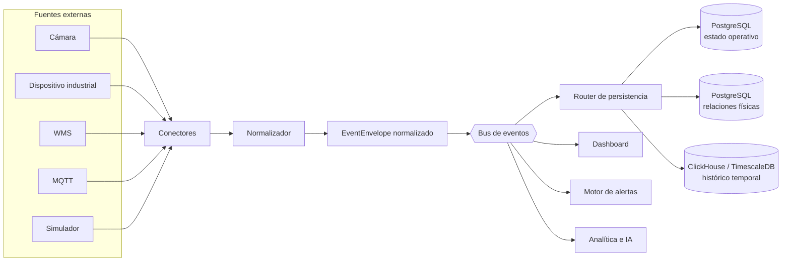
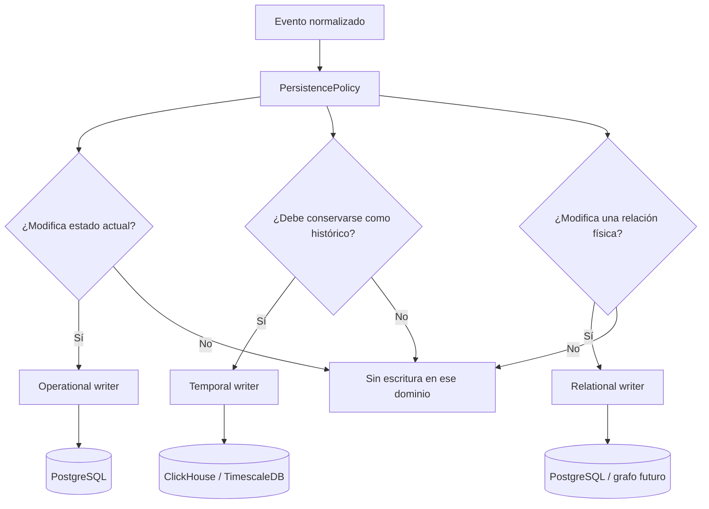
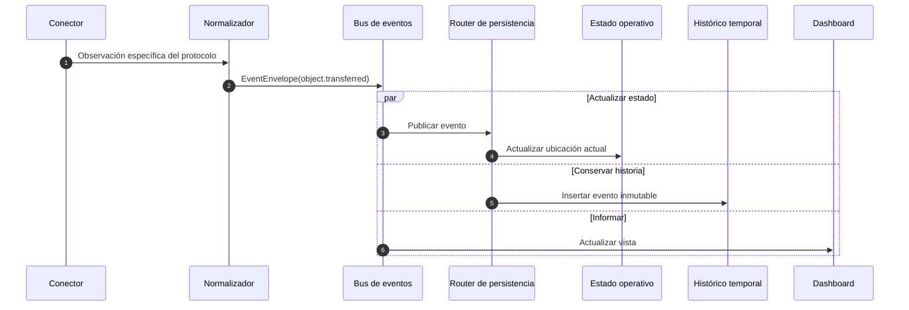
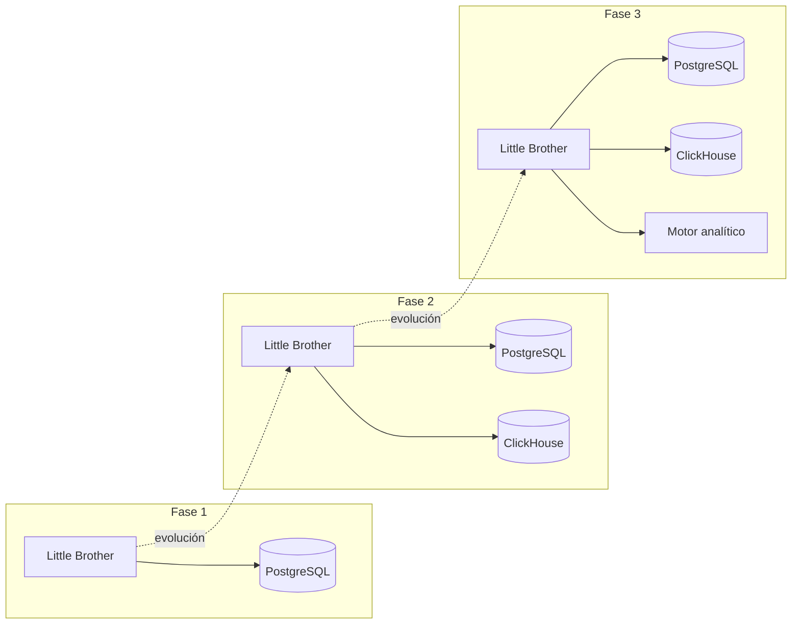

# Arquitectura de Little Brother

## Regla central

Little Brother modela el mundo físico. Las tecnologías externas son fuentes de
observaciones, no entidades centrales del dominio.

```text
Conector -> Normalizador -> Bus de eventos
                              |-> Estado operativo
                              |-> Histórico temporal
                              |-> Relaciones físicas
                              |-> Dashboard
                              |-> Alertas
                              `-> Analítica futura
```



Los conectores no conocen bases de datos. Un conector transforma su protocolo
particular en un `EventEnvelope` normalizado y lo publica mediante `EventBus`.

## Límites de los crates

### `event-core`

Define el sobre normalizado, la fuente tecnológica neutral y los puertos del
bus. No implementa una tecnología de mensajería durable.

### `transport-core`

Representa plantas, transportadores, conexiones, objetos y movimientos. No
depende de `event-core`, PostgreSQL, ClickHouse ni protocolos externos.

### `persistence-core`

Consume eventos y los clasifica en dominios operativo, temporal o relacional.
Solo define puertos; un adaptador futuro decide tablas, SQL, lotes y motor.

## Evolución de persistencia

```text
Fase 1: adaptadores PostgreSQL para los tres dominios
Fase 2: PostgreSQL operativo + ClickHouse/Timescale histórico
Fase 3: consumidores analíticos adicionales
```

El cambio de fase solo reemplaza o agrega implementaciones de
`PersistenceWriter`. Los conectores, eventos y entidades no cambian.

## Flujo de decisión de persistencia

El evento no selecciona una base de datos. Una política externa determina uno
o varios dominios y el router localiza los escritores registrados para ellos.



Un solo evento puede seguir varias ramas. Por ejemplo, la transferencia de una
caja actualiza su ubicación operativa y también se conserva en el histórico.

## Secuencia de una transferencia



## Evolución de despliegue



## Adaptadores futuros

Los adaptadores concretos vivirán fuera de `crates/*-core`:

```text
adapters/
├── bus-nats
├── postgres-operational
├── postgres-relational
└── clickhouse-temporal
```

El bus incluido actualmente es síncrono y en memoria. Sirve para pruebas y para
el prototipo, pero no promete durabilidad. Antes de producción debe sustituirse
por un adaptador durable con confirmación, reintentos, idempotencia y cola de
eventos fallidos.
