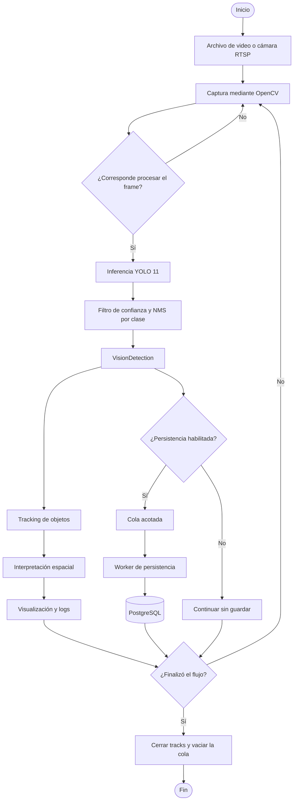
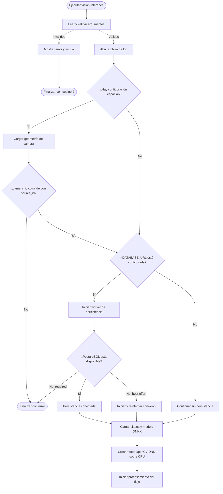
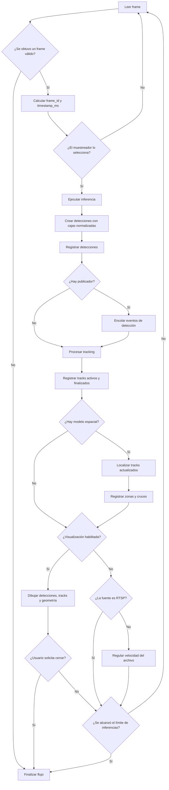
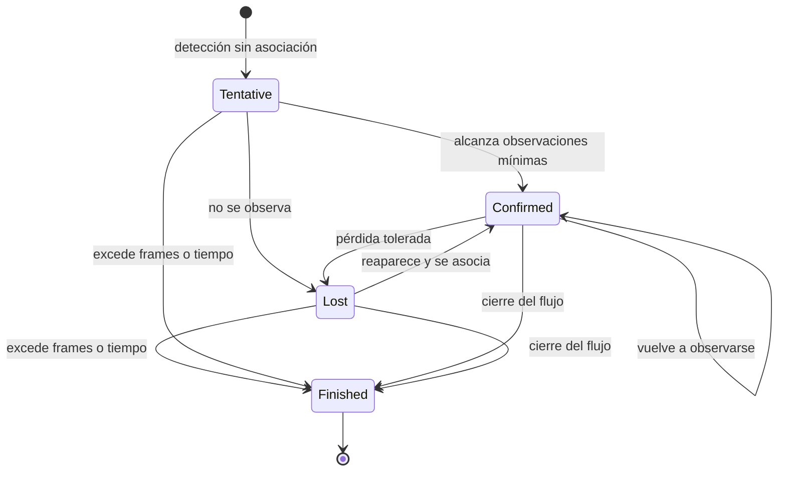
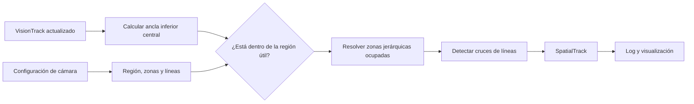
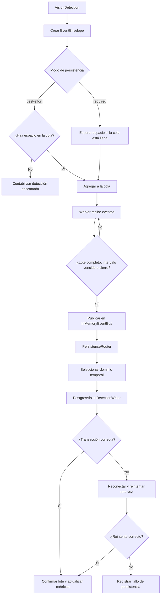
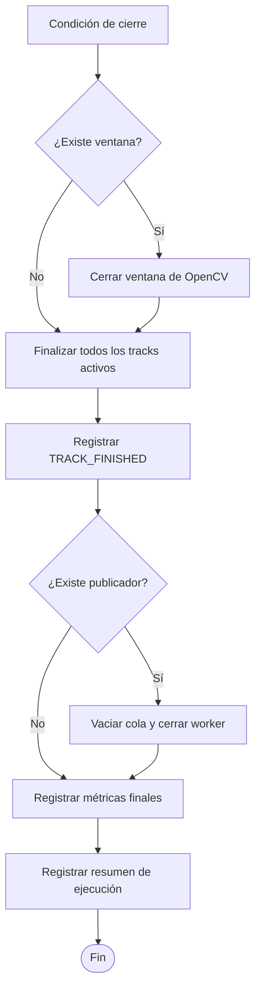
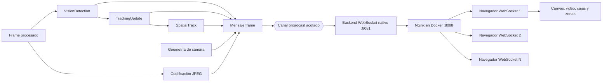
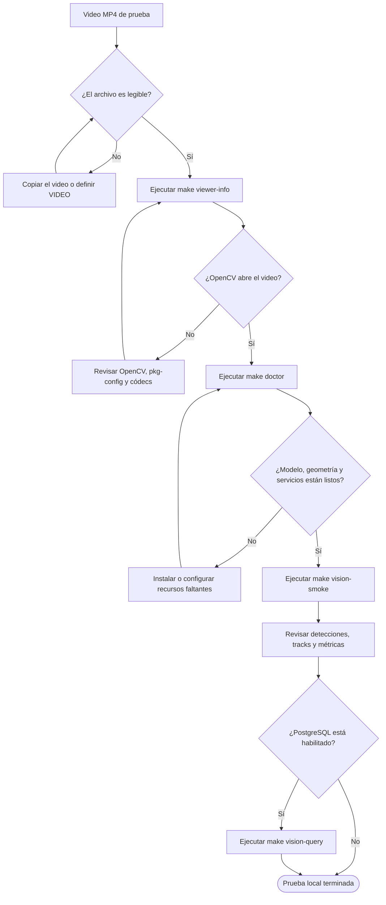

# Diagramas de flujo de Little Brother

Este documento describe los flujos que ejecuta el prototipo actual. Los
diagramas representan el comportamiento implementado; los componentes futuros
se mencionan únicamente en la sección de alcance.

## Alcance actual

Little Brother recibe video desde un archivo o una cámara RTSP, selecciona
frames a una frecuencia configurable, detecta objetos con YOLO 11, conserva su
identidad temporal, interpreta su posición dentro de una geometría de cámara y
puede guardar las detecciones en PostgreSQL.

Actualmente se persiste `VisionDetection`. Los tracks, los resultados
espaciales, el video, las alarmas y las reglas industriales todavía no se
guardan en la base de datos.

## 1. Flujo general del sistema

Este diagrama muestra la ruta completa de una observación, desde la fuente de
video hasta sus dos salidas actuales: visualización y persistencia.

La detección alimenta dos ramas independientes. Tracking y análisis espacial
producen información para la ejecución y los logs; la persistencia recibe la
detección normalizada directamente, por lo que no espera a que termine el
análisis espacial.

## 2. Inicialización del motor de visión

Antes de leer el primer frame, la aplicación valida la configuración, carga
los recursos opcionales y prepara el motor de inferencia.

La configuración espacial y la conexión a PostgreSQL son opcionales. El modelo
ONNX y la fuente de video sí son necesarios para procesar el flujo.

## 3. Procesamiento de cada frame

El muestreador decide según la marca de tiempo de la fuente. En un archivo usa
la posición temporal del video; en RTSP usa un reloj monotónico local.

La visualización es opcional. En modo headless se conservan la inferencia, los
logs, el tracking, el análisis espacial configurado y la persistencia.

## 4. Ciclo de vida de un track

El tracker compara detecciones de la misma clase mediante IoU, distancia entre
centros y una predicción de movimiento normalizada.

Un `track_id` conserva la identidad únicamente dentro de una ejecución y una
cámara. El prototipo no realiza reidentificación entre cámaras ni mantiene el
mismo identificador después de reiniciar el proceso.

## 5. Interpretación espacial

El modelo espacial usa como ancla el punto inferior central de la caja de cada
track actualizado.

Las coordenadas se encuentran en el intervalo `0..1`. La configuración DEMO no
equivale a una calibración métrica y no permite calcular velocidad en metros.

## 6. Persistencia de detecciones

Cada `VisionDetection` se envuelve en un evento normalizado y se entrega a un
worker mediante una cola acotada. El worker agrupa escrituras y ejecuta una
transacción al completar el lote, vencer el intervalo de flush o cerrar el
motor.

En modo `required`, la presión de la base de datos se transmite al productor
para evitar pérdidas. En `best-effort`, la visión continúa aunque la cola esté
llena o PostgreSQL no esté disponible, y las pérdidas se reflejan en métricas.

## 7. Cierre controlado

El cierre puede producirse por fin del archivo, error de lectura, solicitud del
usuario o límite de inferencias.

Este cierre permite enviar el lote pendiente a PostgreSQL y dejar registrados
los tracks que seguían activos al terminar la fuente.

## Relación entre los resultados

| Resultado | Productor | Uso actual | Persistencia actual |
|---|---|---|---|
| `VisionDetection` | `vision-core` / `vision-inference` | Logs, tracking y eventos | Sí |
| `VisionTrack` | `tracking-core` | Identidad y trayectoria visual | No |
| `SpatialTrack` | `spatial-core` | Zonas, líneas, logs y visualización | No |

## 8. Visualización web en vivo

El backend WebSocket es un consumidor opcional dentro del proceso de visión. El
visualizador se sirve desde un contenedor Nginx que reenvía la conexión hacia
el proceso nativo. Solo se codifican frames JPEG cuando existe al menos un
navegador conectado, evitando ese costo cuando el panel no está en uso.

El canal conserva únicamente una ventana pequeña de mensajes. Si un navegador
es demasiado lento, omite frames atrasados y continúa con información reciente;
no bloquea la inferencia ni la persistencia.

## 9. Validación con el video de prueba

El repositorio está configurado localmente para usar
`video prueba/WhatsApp Video 2026-07-20 at 10.07.07 AM.mp4`. El archivo dura
aproximadamente 14 segundos y no se versiona en Git.

`viewer-info` valida la lectura del archivo sin abrir una ventana. Después,
`vision-smoke` limita la ejecución a seis inferencias para comprobar rápidamente
la ruta de detección, tracking, análisis espacial y persistencia configurada.

Para los límites entre crates, contratos y decisiones arquitectónicas, consulte
[Arquitectura de Little Brother](../core/rs/ARCHITECTURE.md). Para comandos de
ejecución y diagnóstico, consulte [Operación](OPERATIONS.md).
