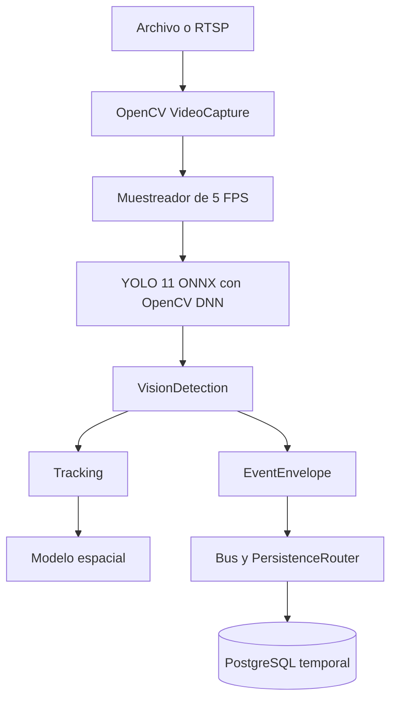

# Documentación de Little Brother

Este directorio documenta el estado real del prototipo. Las descripciones
marcadas como futuras no forman parte del ejecutable actual.

## Mapa de documentos

- [Diagramas de flujo](FLOWS.md): recorrido general, inicialización,
  procesamiento por frame, tracking, análisis espacial, persistencia y cierre.
- [Instalación](INSTALLATION.md): requisitos del SP, OpenCV, Rust, modelo ONNX
  y PostgreSQL.
- [Operación](OPERATIONS.md): comandos, configuración, logs, RTSP, visor,
  diagnóstico y mantenimiento de la base.
- [Modelo de datos](DATA_MODEL.md): contratos Rust, eventos, identificadores,
  tiempos y tabla `temporal.vision_detection`.
- [Fases y estado](PHASES.md): alcance implementado en las fases 1 a 5 y
  funcionalidades pendientes.
- [Arquitectura Rust](../core/rs/ARCHITECTURE.md): límites entre crates,
  diagramas de flujo y estrategia de persistencia.
- [Organización del workspace](../core/rs/README.md): árbol de módulos y
  responsabilidades de cada archivo.
- [Modelo YOLO local](../core/yolo/models/README.md): ubicación y checksum del
  archivo ONNX.

## Estado resumido



La explicación paso a paso y los flujos alternativos están en
[Diagramas de flujo](FLOWS.md).

El proceso Rust se ejecuta directamente en el SP. PostgreSQL y el visualizador
web Nginx se ejecutan en contenedores separados.

## Inicio rápido

```bash
cp .env.example .env
make infra-up
make doctor
make check
make vision-smoke
make vision-query
```

Para abrir la visualización:

```bash
make vision
```

Si el puerto `5432` ya está ocupado:

```bash
make infra-up DB_PORT=55432
make vision-smoke DB_PORT=55432
```

## Fuentes de verdad

Cuando la documentación y el código difieran, estas son las fuentes de verdad:

| Tema | Archivo |
|---|---|
| Comandos y valores predeterminados | [`Makefile`](../Makefile) |
| Opciones del motor | [`config.rs`](../core/rs/apps/vision-inference/src/config.rs) |
| Geometría DEMO | [`camera-1.spatial`](../core/vision/config/camera-1.spatial) |
| Esquema PostgreSQL | [`0001_temporal_vision_detection.sql`](../core/rs/crates/persistence-postgres/migrations/0001_temporal_vision_detection.sql) |
| Dependencias Rust | [`Cargo.lock`](../core/rs/Cargo.lock) |
| Contenedor PostgreSQL | [`docker-compose.yml`](../docker-compose.yml) |
